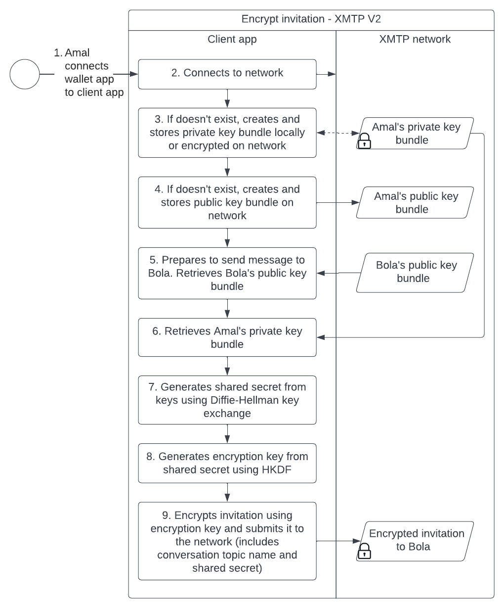
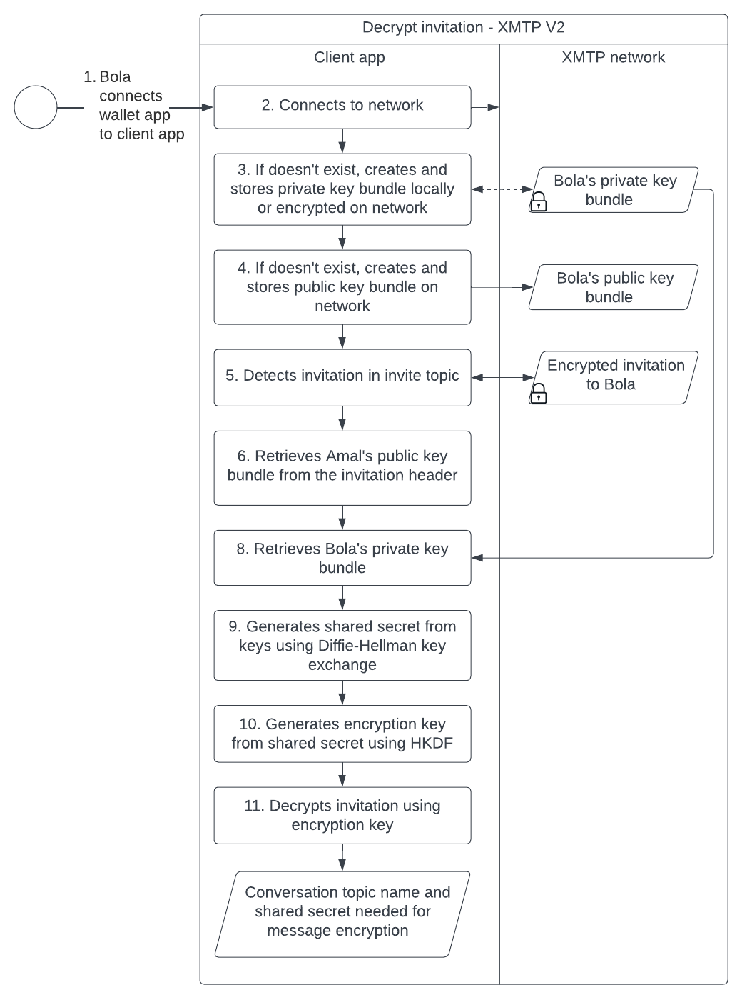
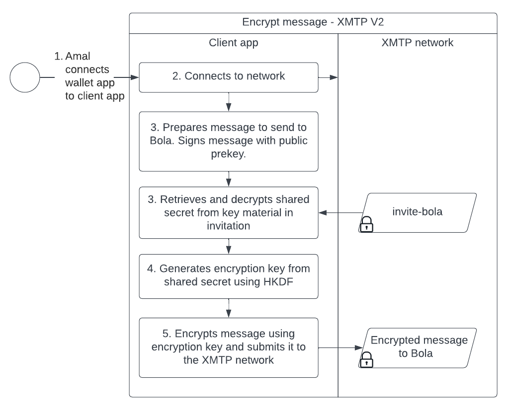

# Participant authentication and message encryption with XMTP

## Participant authentication

The XMTP SDK enables client apps to establish secure, unfalsifiable relationships between XMTP identities in which only the sender and recipient can decrypt messages sent between them. The protocol design also accommodates asynchronous offline communication and secure storage of messages.

These relationships between XMTP identities are established using a set of keys. When a user connects their blockchain account to their client app, their wallet app signs with the account's public and private key. This enables the XMTP SDK to generate the following keys:

- `IdentityPrivateKey`
- `IdentityPublicKey`
- `PreKeys`

You can think of the `IdentityPrivateKey` and `IdentityPublicKey` as proxies for a user's blockchain account keys.

Because XMTP cannot access the actual blockchain account keys, XMTP generates `IdentityPrivateKey` and `IdentityPublicKey` and asks the user to vouch for them by signing them with their blockchain account keys.

Anyone can verify the user's signature and consider it as an attestation that the `IdentityPrivateKey` and `IdentityPublicKey` are the user's true proxy keys since only the user's keys could have created the signature.

To learn more about signatures, see [Signatures](signatures).

The client app publishes the user's `IdentityPublicKey` and `PreKeys` to the XMTP network in a `PublicKeyBundle`. The `PublicKeyBundle` contains all of the information needed for someone to contact the user.

The `IdentityPrivateKey` (and a copy of the other keys, for good measure) are encrypted and stored locally by the client app or on the XMTP network. Only client apps authorized by the user can access these encrypted keys. By design, XMTP and the XMTP network cannot access these encrypted keys.

## Message encryption

All XMTP messages are encrypted. This section describes XMTP V1 and V2 message encryption flows.

:::info

For a period of time, the XMTP network will support both V1 and V2 message encryption flows to give developers time to upgrade their client apps to use XMTP client SDK for JavaScript (xmtp-js) >=v7.0.0, which will provide their apps with V2 functionality. After support for V1 topics and flows is deprecated, client apps that have not upgraded to >=v7.0.0 may be unable to communicate with the XMTP network.

:::

### XMTP V1 message encryption

With XMTP V1, a client app encrypts and decrypts messages using the following artifacts:

- Public key bundle (per user)
- Private key bundle (per user)
- Shared secret (per sender and recipient pair)
- Encryption key (per sender and recipient pair)

Here’s a high-level overview of the message encryption and decryption flow for XMTP V1:

 <!--source file: https://www.figma.com/file/1jasKMIn5sAL4855eTwgIm/xmtp-architectural-overview?node-id=324%3A1120-->

The following sequence diagram dives a bit deeper into the flow and illustrates how a client app creates and uses these artifacts to encrypt a message:

 <!--source file: https://lucid.app/lucidchart/d2985646-969e-4625-82f0-cb38853033c5/edit?view_items=jOX3cckT1jt4&invitationId=inv_2faa4c23-7fdb-40d8-9b78-e9c4557b712d-->

Likewise, this sequence diagram illustrates the message decryption process:

 <!--source file: https://lucid.app/lucidchart/d2985646-969e-4625-82f0-cb38853033c5/edit?view_items=jOX3cckT1jt4&invitationId=inv_2faa4c23-7fdb-40d8-9b78-e9c4557b712d-->

### XMTP V2 invite encryption

With XMTP V2, a client app encrypts and decrypts invites using the following artifacts:

- Public key bundle (per user)
- Private key bundle (per user)
- Shared secret (per sender and recipient pair)
- Encryption key (per sender and recipient pair)

The following sequence diagram dives a bit deeper into the flow and illustrates how a client app creates and uses these artifacts to encrypt an invite:

 <!--source file: https://lucid.app/lucidchart/e2f80322-b2c9-44c1-8f20-421628e4f9ed/edit?viewport_loc=-389%2C-1224%2C3032%2C1592%2C0_0&invitationId=inv_4013c892-b596-4097-bcfd-a50a233de812-->

Likewise, this sequence diagram illustrates the invite decryption process:

 <!--source file: https://lucid.app/lucidchart/e2f80322-b2c9-44c1-8f20-421628e4f9ed/edit?viewport_loc=-389%2C-1224%2C3032%2C1592%2C0_0&invitationId=inv_4013c892-b596-4097-bcfd-a50a233de812-->

### XMTP V2 message encryption

With XMTP V2, a client app encrypts and decrypts messages using the following artifacts:

- Shared secret (per invitees to a conversation)
- Encryption key (per invitees to a conversation)
<!--not sure about the second bullet. I know that every invitee to a conversation has the same shared secret - I think this means that each of them will generate the same encryption key through HKDF as well?-->

On a related note, the encrypted message is signed by the sender using their private key. Upon decryption but before presentation to the recipient, the client app uses the sender's public key from the message header to verify the sender of the message.

The following sequence diagram dives a bit deeper into the flow and illustrates how a client app creates and uses these artifacts to encrypt and sign a message:

 <!--source file: https://lucid.app/lucidchart/9ec2b0e2-df13-4d06-82c7-59068059b8a7/edit?viewport_loc=-1118%2C-613%2C3110%2C1633%2C0_0&invitationId=inv_857afa87-d52e-4236-8a9f-c5818c65df04-->

Likewise, this sequence diagram illustrates the message decryption and sender verification process:

 <!--source file: https://lucid.app/lucidchart/9ec2b0e2-df13-4d06-82c7-59068059b8a7/edit?viewport_loc=-1118%2C-613%2C3110%2C1633%2C0_0&invitationId=inv_857afa87-d52e-4236-8a9f-c5818c65df04-->

## Algorithms in use

XMTP supports the replacement and expansion of supported algorithms in a backward-compatible manner.

Supported algorithms are selected based on fairly pragmatic criteria. For example, the algorithm must be:

- Tried and true and in widespread use
- Well-supported in desirable XMTP client app languages, such as JavaScript
- Available in standard browser APIs, rather than via third-party dependencies

XMTP also aims to reuse existing algorithms, looking to well-known and standard algorithms with trustworthy implementations.

As such, XMTP's cryptographic primitives are built around the standard [Web Crypto API](https://developer.mozilla.org/en-US/docs/Web/API/SubtleCrypto) and the [@noble libraries](https://www.npmjs.com/package/@noble/secp256k1), using components of Signal's X3DH protocol for secure offline communication.

Specifically, XMTP's participant authentication and message encryption algorithm choices include:

- EC Public/Private Keys (secp256k1)
- ECDSA signatures and signing of public keys (ECDSA and EIP-191)
- Shared secret derivation (ECDH/X3DH)
- Authenticated symmetric encryption (AEAD: AES-256-GCM)
- Symmetric key derivation (HKDF-SHA-256)
- X3DH-style key bundles ([X3DH Key Agreement Protocol](https://signal.org/docs/specifications/x3dh/))
