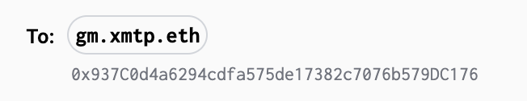

import ActivateDMsImageUrl from '/docs/dev-concepts/img/activate-dms-screen.png';
import allinorbImageUrl from '/docs/dev-concepts/img/all-in-orb.png';
import lensonlyorbImageUrl from '/docs/dev-concepts/img/lens-only-orb.png';
import buttrflyfollowonlyImageUrl from '/docs/dev-concepts/img/buttrfly-follow-only.png';
import pnsettingsinorbImageUrl from '/docs/dev-concepts/img/push-notif-settings.png';
import decryptpninconverseImageUrl from '/docs/dev-concepts/img/push-notifs-decrypted.jpg';
import badginginorbImageUrl from '/docs/dev-concepts/img/badging-orb.jpg';

# UX best practices when building with XMTP

Consider these UX best practices when building your app with XMTP.

## General

- If needed, use XMTP brand assets provided here: [XMTP brand guidelines](https://github.com/xmtp/brand).

- Provide ENS name resolution. For example, here is ENS name resolution in xmtp.chat:

  
    
- Provide helpful error messaging when a user enters an address in the **To** field and the address hasn't create an XMTP identity.

  

- When displaying .eth names, look for and display an ENS avatar.
When displaying .lens names, look for and display a Lens profile photo.
Use blockies for raw 0x addresses.

## Onboarding

- In your app onboarding flow, enable your users to activate XMTP DMs. This can help with app engagement and reengagement. For example, here is a prompt to activate XMTP DMs in the Lens onboarding flow:

  

- In your app onboarding flow, request user permission for app-specific push notifications to be able to reach users outside of an app session.

## Conversation filtering and consent

- Provide an [interoperable inbox](https://xmtp.org/docs/dev-concepts/interoperable-inbox) UI in your app. This inbox enables your user to access and engage with all of their conversations without leaving your app. An interoperable inbox is the default state of [listing conversations](/docs/client-sdk/javascript/tutorials/quickstart#conversations). For example, here is an interoperable inbox in the Orb app:

  

- Consider using conversation IDs to provide [filtered views of conversations](/docs/client-sdk/javascript/tutorials/filter-conversations). For example, here is the Orb app with conversations filtered to show Lens conversations only:

    

- Provide client-side functionality that enables a user to grant/revoke consent for another user to message them.

- Enable users to filter based on friends on a social graph, such as Lens, or a client-side grant/revoke list. For example, here is the [Buttrfly app](https://buttrfly.app/) displaying only conversations with Lens profiles you follow:

    

## Push notifications

- Provide a separate setting for enabling and disabling direct message push notifications. For example, if you’re building a Lens app, provide a setting for XMTP push notifications that’s separate from Lens push notifications for posts, comments, likes, and so forth.. For example, here are push notification settings in the [Orb app](https://orb.ac/):

    

- Decrypt messages for push notifications so you can display the contents within the push. For example, here is a decrypted push notifications provided by the [Converse app](https://getconverse.app/).

    

- Display push notifications for only messages sent **to** a user. In other words, do not send a push notification to a user for a message they sent. To do this, filter out messages sent by the user and don't send push notifications for them.

## Badging

- Unbadge conversations where the user sent the latest message. This implies that they’ve seen the conversation and avoids unnecessary badges as users DM across different apps.

- On the icon/button for the Inbox (messaging sheet), display badges or the number of unread conversations to increase interaction success. For example, here is badging in the Orb app:

    
