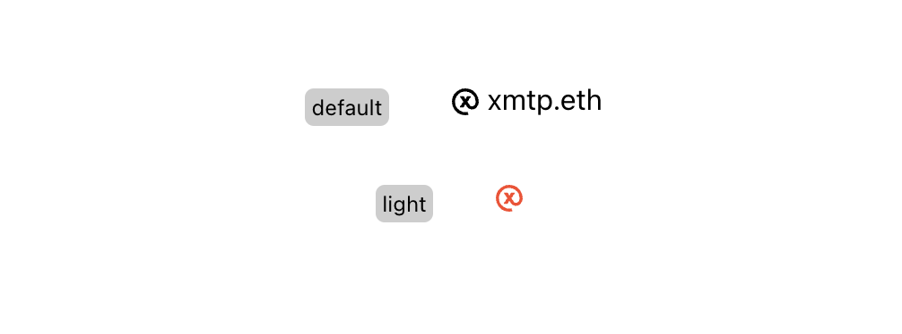
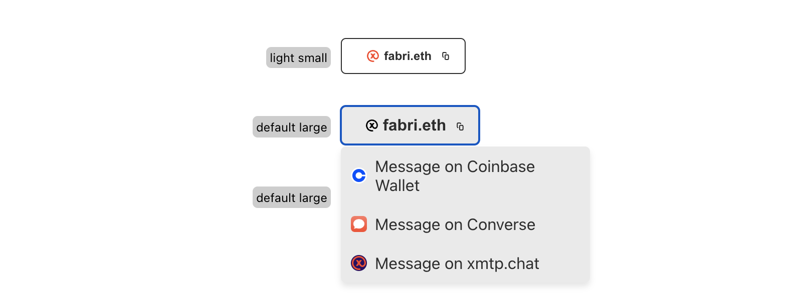
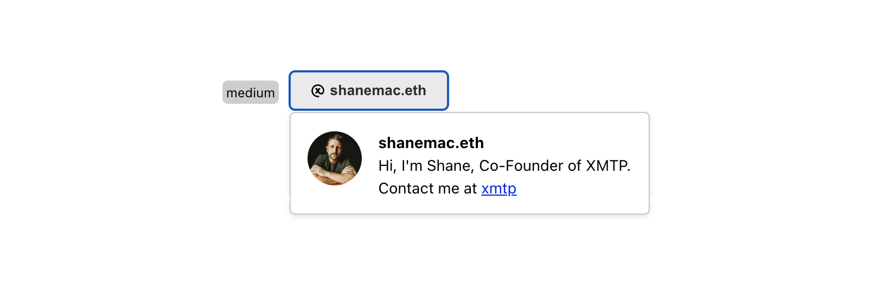
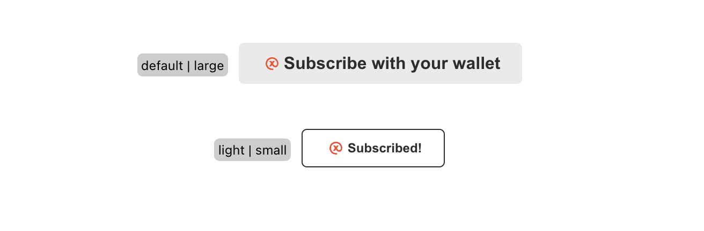
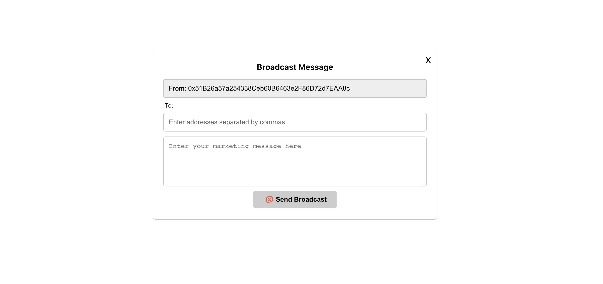
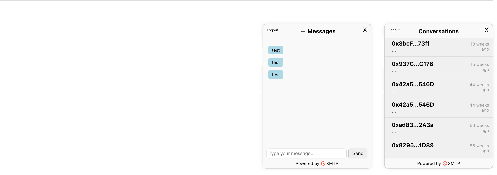

# XMTP Integrations

UWidgets are a collection of React components that can be used to create interactive user interfaces. `U` stands for `Universal`. The following widgets are available:

### **UConnect**



The **`UConnect`** widget serves as a contact button, typically positioned in the header or footer of business websites for optimal visibility and accessibility.

**Properties:**

- **`domain`**: Domain name associated with the user (e.g., "xmtp.eth").
- **`walletAddress`**: Wallet address of the user.
- **`defaultApp`**: Messaging application name
- **`theme`**: Accepts values "default", "dark", or "light".
- **`showText`**: A boolean value determining whether to display the text.
- **`defaultApp`**: (Optional) Name of the messaging app for contact.
- **`deepLinkApps`**: (Optional) An object containing information about different messaging apps.

**Example Usage:**

```jsx
<UConnect
  domain="xmtp.eth"
  walletAddress="0xUserWalletAddress"
  theme="light"
  showText={true}
/>
```

## **UButton**



The **`UButton`** widget allows users to display buttons with different themes and sizes. You can use it as follows:

**Properties:**

- **`domain`**: Domain name associated with the user (e.g., "fabri.eth").
- **`walletAddress`**: Wallet address of the user (e.g., "0xUserWalletAddress").
- **`theme`**: Accepts values "default", "dark", or "light".
- **`size`**: Accepts values "small", "medium", or "large".
- **`defaultApp`**: (Optional) Name of the messaging app for contact.
- **`deepLinkApps`**: (Optional) An object containing information about different messaging apps.

**Example Usage:**

```jsx
<UButton
  domain="fabri.eth"
  walletAddress="0xUserWalletAddress"
  theme="dark"
  size="medium"
/>
```

## **UProfileCard**



Here's a simple example of how to use the UProfileCard component:

```jsx
<UProfileCard
  domain="shanemac.eth"
  walletAddress="0xUserWalletAddress"
  image="image.png"
  name="Shane"
  description="Hi, I'm Shane, Co-Founder of XMTP."
/>
```

**Properties:**

- **`domain`**: (Required) Your Domain name.
- **`walletAddress`**: (Required) Your wallet address.
- **`image`**: (Required) URL or path to the image of the person or company.
- **`name`**: (Required) Name of the person or company.
- **`description`**: (Required) A short description.
- **`defaultApp`**: (Optional) Name of the messaging app for contact.
- **`deepLinkApps`**: (Optional) An object containing information about different messaging apps.

## **USubscribe**



Here's a simple example of how to use the USubscribe component:

**Properties:**

- `theme`: (Optional) Set the theme. Available options: 'default', 'dark', 'light'. Default is 'default'.
- `size`: (Optional) Set the button size. Available options: 'small', 'medium', 'large'. Default is 'medium'.
- `wallet`: (Required) An instance of ethers.js signer.
- `checkSubscriptionStatus`: (Required) A function that checks the subscription status of a given address.
- `onSubscribe`: (Required) A callback function that is called when a new subscription is made.
- `onUnsubscribe`: (Required) A callback function that is called when a subscription is cancelled.
- `onError`: (Required) A callback function that is called when an error occurs during subscription or unsubscription.
- **`env`**: XMTP developer environment. Read more [here](https://xmtp.org/docs/build/authentication#environments)

**Example Usage:**

```jsx
<USubscribe
  theme="default"
  size="medium"
  wallet={signer}
  checkSubscriptionStatus={(address) => checkSubscriptionStatus(address)}
  onSubscribe={(address) => console.log("New subscriber: " + address)}
  onUnsubscribe={(address) => console.log("Unsubscribed: " + address)}
  onError={(address) => console.log("Error subscribing: " + address)}
  env={"production"}
/>
```

## **UBroadcast**



The **`UBroadcast`** widget enables the user to broadcast messages to specified Ethereum addresses.

**Properties:**

- **`theme`**: Accepts values "default", "dark", or "light".
- **`size`**: Accepts values "small", "medium", or "large".
- **`placeholderMessage`**: A string for placeholder text in the message input (e.g., "Enter your marketing message here").
- **`walletAddresses`**: Wallet addresses that you want to send a broascast message.
- **`env`**: XMTP developer environment. Read more [here](https://xmtp.org/docs/build/authentication#environments)

**Example Usage:**

```jsx
<UBroadcast
  theme="dark"
  size="medium"
  wallet={signer}
  walletAddresses={array}
  placeholderMessage="Enter a broadcast message here"
  env={"production"}
/>
```

You can also control UBroadcast programmatically:

- **`window.ubroadcast.open()`**: Opens the UBroadcast widget.
- **`window.ubroadcast.close()`**: Closes the UBroadcast widget.

## **UInbox**



The **`UInbox`** widget is a specific control element. While the usage within the code is minimal, you can include the UInbox in your component tree simply by:

```jsx
<UInbox wallet={signer} env={"production"} />
```

**Properties:**

- `wallet`: (Required) An instance of ethers.js signer.
- **`env`**: XMTP developer environment. Read more [here](https://xmtp.org/docs/build/authentication#environments)

You can also control UInbox using global methods:

- **`window.uinbox.open()`**: Opens the UInbox.
- **`window.uinbox.close()`**: Closes the UInbox.

These documentation details offer insights into how to implement and manipulate each widget within your React application based on the provided code.

## Deep Link Apps

In the `src/deepLinkApps.js` file, we have a `deepLinkApps` object that contains information about different messaging apps. This object is structured as follows:

```jsx
//Alphabetical order
export const deepLinkApps = {
  xmtp: {
    url: `https://xmtp.chat/dm/{walletAddress}`,
    icon: "https://xmtp.chat/favicon.ico",
    device: ["Desktop"],
    name: "xmtp",
  },
  CustomApp: {
    url: `https://xmtp.chat/dm/{walletAddress}`,
    icon: "https://xmtp.chat/favicon.ico",
    device: ["All"],
    name: "Custom App",
  },
};
```

Each key in the `deepLinkApps` object represents a different messaging app. Each app has the following properties:

- **`url`**: The URL for direct messaging in the app. The `{walletAddress}` placeholder will be replaced with the actual wallet address.
- **`name`**: The descriptive name of the app.
- **`icon`**: The URL of the app's favicon.
- **`device`**: An array of operating systems where the app is available. "All" means the app is available on all operating systems.

**Example Usage:**

This custom configuration works with `UButton`, `UConnect` and `UProfileCard`. All widgets that have deeplinking use case.

```jsx
<UButton
 /*Other props*/
defaultApp = "CustomApp";
deepLinkApps = { deepLinkApps };
/>
```

This way, contributors can easily add new apps by modifying the `deepLinkApps.js` file through PR's.

## Wallet Signer

Please note that all widgets in this library that require a wallet signer only accept an instance of the `ethers.js` signer. Other types of signers are not supported at this time.

The signer is **optional**. If the signer is not detected, the widgets have a built-in mechanism to establish a connection.

For example, when using the `USubscribe` or `UInbox` widgets, you should provide an `ethers.js` signer instance like so:

```jsx
<USubscribe
  /* Other props */
  wallet={signer}
/>
```

```jsx
<UInbox /* Other props */ wallet={signer} />
```

Ensure that you have properly initialized the `ethers.js` signer instance before passing it to the widget.
