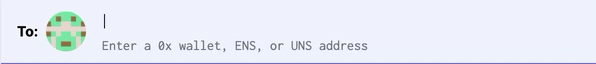
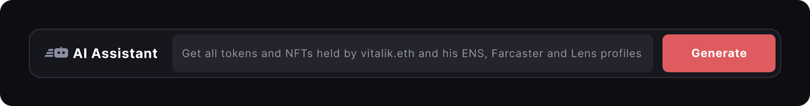
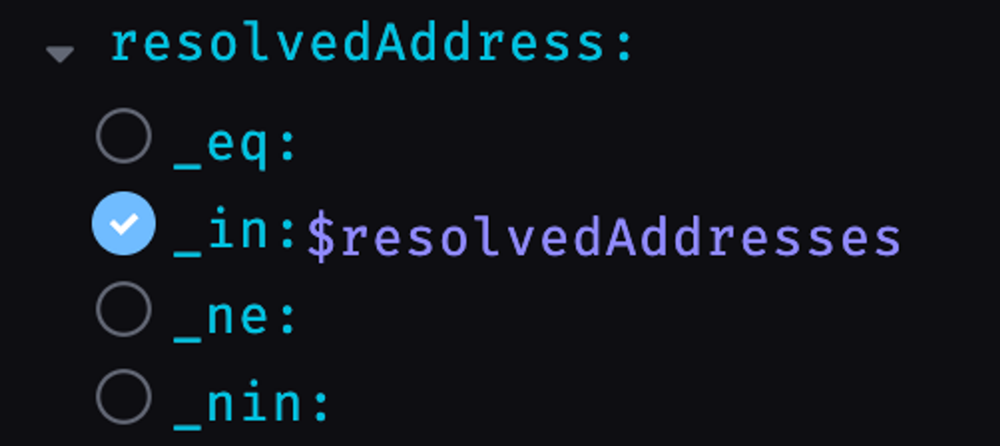

# Wallet connectors with XMTP

In this tutorial, we will explore how to integrate different wallets into XMTP, allowing users to securely interact with the XMTP ecosystem. We will cover the integration process using various wallet connectors, including Dynamic, ThirdWeb, and Rainbow. By following this tutorial, you will be able to offer a seamless and user-friendly wallet integration experience within your XMTP applications.

<div className="bigTab">

import Tabs from "@theme/Tabs";
import TabItem from "@theme/TabItem";

When you build with XMTP, there’s no cold start for your app and your users. As soon as your app plugs into the XMTP network, it's able to reach today’s most popular and meaningful identities.

XMTP’s interoperability and composability help ensure that the network can continue to grow and bring messaging to every identity—via your app.

In this context, **identity** refers to:

- Wallet addresses, such as raw 0x addresses like `0x4b70d04124c2996De29e0caa050A49822Faec6Cc`
- Human-readable domain names associated with wallet addresses. These domain names are provided by name services, such as Ethereum Name Service (ENS) and Unstoppable Domains (UNS).

As a UX best practice, build your app to enable a user to enter a domain name in the To field and have it resolve to its associated raw wallet address.

For example, a user should be able to enter `prxshant.eth` in your To field and have your app forward-resolve and display its associated wallet address `0x4b70d04124c2996De29e0caa050A49822Faec6Cc`.

<div className="nopadding" style={{width:'50%'}}  >



</div>

And certainly, your app should also be able to accept a raw wallet address and reverse-resolve and display the associated domain name, if available.

When displaying a name, also look for and display its associated avatar. For example, when displaying a `.lens` name, look for and display a Lens profile photo. Display blockies as avatars for raw 0x addresses.

## Resolve identities

<Tabs >
<TabItem value="airstack"  attributes={{className: "bigTab_tab airstack_tab"}} label="Airstack" default>

In this tutorial, you will learn how to use Airstack as a universal resolver to resolve various web3 identities (e.g. Farcaster, Lens, and ENS) and Ethereum addresses to other web3 identities. Airstack provides JSON APIs and SDKs for React and Python.

To access the Airstack APIs, use https://api.airstack.xyz/gql as your JSON endpoint.

### Prerequisites

- [An Airstack account](https://app.airstack.xyz) (free)
- Basic Knowledge of JSON

### 🤖 AI Natural Language

Airstack provides an [AI solution](https://app.airstack.xyz/explorer) for you to build a JSON query to fulfill your use case easily.

<div className="nopadding" style={{width:'90%'}}  >



</div>

### Reverse resolution

For example, if you would like to get the web3 identity of a user, e.g. all the web3 socials and ENS of the `0xd8dA6BF26964aF9D7eEd9e03E53415D37aA96045` address, then you can simply type into the prompt:

<Tabs>
<TabItem value="prompt" label="Prompt"  >

```bash
For the 0xd8dA6BF26964aF9D7eEd9e03E53415D37aA96045 address, get all web3 socials and ENS
```

</TabItem>
</Tabs>

After clicking enter, the Airstack AI will output a JSON query that will fetch the web3 identities of the given address that will look as follows:

<Tabs>
<TabItem value="request" label="Query" >

With this query, you can get all web3 identities of the given user wallet, which will include the wallet address, ENS names, Farcaster username, and Lens profile.

```graphql
query web3Data {
  Wallet(
    input: {
      identity: "0xd8dA6BF26964aF9D7eEd9e03E53415D37aA96045"
      blockchain: ethereum
    }
  ) {
    socials {
      dappName
      profileName
    }
    primaryDomain {
      name
    }
    domains {
      name
    }
  }
}
```

</TabItem>
<TabItem value="response" label="Response" >

```graphql
{
  "data": {
    "Wallet": {
      "socials": [
        {
          "dappName": "farcaster",
          "profileName": "vbuterin"
        },
        {
          "dappName": "lens",
          "profileName": "vitalik.lens"
        }
      ],
      "primaryDomain": {
        "name": "satoshinart.eth"
      },
      "domains": [
        {
          "name": "quantumexchange.eth"
        },
        {
          "name": "7860000.eth"
        },
        {
          "name": "brianshaw.eth"
        },
        {
          "name": "vbuterin.stateofus.eth"
        },
        {
          "name": "quantumsmartcontracts.eth"
        },
        {
          "name": "openegp.eth"
        },
        {
          "name": "vitalik.cannafam.eth"
        },
        {
          "name": "quantumdapps.eth"
        },
        {
          "name": "vitalik.soy.eth"
        },
        {
          "name": "satoshinart.eth"
        }
      ]
    }
  }
}
```

</TabItem>

</Tabs>

The same query can be done starting from an ENS name, Lens profile, or Farcaster username to resolve the other identities all at once. Example:

```bash
For vitalik.eth, get all web3 socials and ENS
```

After clicking enter, the Airstack AI will output a JSON query that will fetch the web3 identities of the given address that will look as follows:

<Tabs>
<TabItem value="request" label="Query" >

With this query, you can get all web3 identities of the given user wallet, which will include the wallet address, ENS names, Farcaster username, and Lens profile.

```graphql
query vitalikSocialsAndENS {
  Wallet(input: { identity: "vitalik.eth", blockchain: ethereum }) {
    socials {
      dappName
      profileName
      profileCreatedAtBlockTimestamp
      userAssociatedAddresses
    }
    primaryDomain {
      name
      owner
      resolvedAddress
      isPrimary
    }
    domains {
      name
      owner
      resolvedAddress
    }
  }
}
```

</TabItem>
<TabItem value="response" label="Response" >

```graphql
{
  "data": {
    "Wallet": {
      "socials": [
        {
          "dappName": "farcaster",
          "profileName": "vbuterin",
          "profileCreatedAtBlockTimestamp": "2022-11-18T20:44:00Z",
          "userAssociatedAddresses": [
            "0xd8da6bf26964af9d7eed9e03e53415d37aa96045",
            "0xadd746be46ff36f10c81d6e3ba282537f4c68077"
          ]
        },
        {
          "dappName": "lens",
          "profileName": "vitalik.lens",
          "profileCreatedAtBlockTimestamp": "2022-11-12T11:05:35Z",
          "userAssociatedAddresses": [
            "0xd8da6bf26964af9d7eed9e03e53415d37aa96045"
          ]
        }
      ],
      "primaryDomain": {
        "name": "satoshinart.eth",
        "owner": "0x7e36c90f1b11a9ab48b2426f1247a0754a19a741",
        "resolvedAddress": "0xd8da6bf26964af9d7eed9e03e53415d37aa96045",
        "isPrimary": true
      },
      "domains": [
        {
          "name": "quantumexchange.eth",
          "owner": "0xd8da6bf26964af9d7eed9e03e53415d37aa96045",
          "resolvedAddress": "0xd8da6bf26964af9d7eed9e03e53415d37aa96045"
        },
        {
          "name": "7860000.eth",
          "owner": "0xd6e510fc09227a837d43448a761e5597a8361e04",
          "resolvedAddress": "0xd8da6bf26964af9d7eed9e03e53415d37aa96045"
        },
        {
          "name": "brianshaw.eth",
          "owner": "0xd8da6bf26964af9d7eed9e03e53415d37aa96045",
          "resolvedAddress": "0xd8da6bf26964af9d7eed9e03e53415d37aa96045"
        },
        {
          "name": "vbuterin.stateofus.eth",
          "owner": "0xb1edfe0273e46d4368e8032408cc87d3ed86ce36",
          "resolvedAddress": "0xd8da6bf26964af9d7eed9e03e53415d37aa96045"
        },
        {
          "name": "quantumsmartcontracts.eth",
          "owner": "0xd8da6bf26964af9d7eed9e03e53415d37aa96045",
          "resolvedAddress": "0xd8da6bf26964af9d7eed9e03e53415d37aa96045"
        },
        {
          "name": "openegp.eth",
          "owner": "0xd8da6bf26964af9d7eed9e03e53415d37aa96045",
          "resolvedAddress": "0xd8da6bf26964af9d7eed9e03e53415d37aa96045"
        },
        {
          "name": "vitalik.cannafam.eth",
          "owner": "0xdcbf49bdb92b2aa84de4e428fd5b2c9c58412bc5",
          "resolvedAddress": "0xd8da6bf26964af9d7eed9e03e53415d37aa96045"
        },
        {
          "name": "quantumdapps.eth",
          "owner": "0xd8da6bf26964af9d7eed9e03e53415d37aa96045",
          "resolvedAddress": "0xd8da6bf26964af9d7eed9e03e53415d37aa96045"
        },
        {
          "name": "vitalik.soy.eth",
          "owner": "0xdcbf49bdb92b2aa84de4e428fd5b2c9c58412bc5",
          "resolvedAddress": "0xd8da6bf26964af9d7eed9e03e53415d37aa96045"
        },
        {
          "name": "satoshinart.eth",
          "owner": "0x7e36c90f1b11a9ab48b2426f1247a0754a19a741",
          "resolvedAddress": "0xd8da6bf26964af9d7eed9e03e53415d37aa96045"
        }
      ]
    }
  }
}
```

</TabItem>
</Tabs>

### Identity resolution

Get the address of an ENS domain, Lens handle, or Farcaster user.

<Tabs className="lensicons">

<TabItem value="ens" label="ENS" attributes={{className: "ens_tab"}}>

AI Prompt:

```bash
get the wallet address of vitalik.eth
```

<Tabs>
<TabItem value="request" label="Query" >

```graphql
query {
  Wallet(input: { identity: "vitalik.eth", blockchain: ethereum }) {
    addresses
  }
}
```

</TabItem>
<TabItem value="response" label="Output" >

```graphql
{
  "data": {
    "Wallet": {
      "addresses": ["0xd8da6bf26964af9d7eed9e03e53415d37aa96045"]
    }
  }
}
```

</TabItem>
</Tabs>

</TabItem>
<TabItem value="lens" label="Lens"  attributes={{className: "lens_tab"}}>

AI Prompt:

```bash
get the wallet address of fabri.lens
```

<Tabs>
<TabItem value="request" label="Query" >

```graphql
query {
  Wallet(input: { identity: "fabri.lens", blockchain: ethereum }) {
    addresses
  }
}
```

</TabItem>
<TabItem value="response" label="Output" >

```graphql
{
  "data": {
    "Wallet": {
      "addresses": ["0x7e0b0363404751346930af92c80d1fef932cc48a"]
    }
  }
}
```

</TabItem>
</Tabs>

</TabItem>
<TabItem value="farcaster" label="Farcaster" attributes={{className: "farcaster_tab"}}>

AI Prompt:

```bash
get the wallet address of Farcaster user vbuterin
```

<Tabs>
<TabItem value="request" label="Query" >

```graphql
query {
  Wallet(input: { identity: "fc_fname:vbuterin", blockchain: ethereum }) {
    addresses
  }
}
```

</TabItem>
<TabItem value="response" label="Output" >

```graphql
{
  "data": {
    "Wallet": {
      "addresses": [
        "0xd8da6bf26964af9d7eed9e03e53415d37aa96045",
        "0xadd746be46ff36f10c81d6e3ba282537f4c68077"
      ]
    }
  }
}
```

</TabItem>
</Tabs>

</TabItem>
</Tabs>

#### Get the Lens name of a Farcaster user

<Tabs>
<TabItem value="prompt" label="Prompt"  >

```bash
For Farcaster user vbuterin, fetch their Lens name
```

</TabItem>
</Tabs>

<Tabs>
<TabItem value="request" label="Request" >

```graphql
query {
  Wallet(input: { identity: "fc_fname:vbuterin", blockchain: ethereum }) {
    socials {
      dappName
      profileName
    }
  }
}
```

</TabItem>
<TabItem value="response" label="Response" >

```graphql
{
  "data": {
    "Wallet": {
      "socials": [
        {
          "dappName": "farcaster",
          "profileName": "vbuterin"
        },
        {
          "dappName": "lens",
          "profileName": "vitalik.lens"
        }
      ]
    }
  }
}
```

</TabItem>
</Tabs>

### Bulk resolution queries

If you have multiple inputs to call the same query, you can use Airstack to make a **single bulk query call** to get all the responses more efficiently instead of making multiple calls with each individual input.

To create a bulk query, your query will need to have a filter input with the comparison operations of `_in` or `_nin`. A quick look at how it looks in the [Airstack Explorer](https://app.airstack.xyz/explorer) is shown below with the `resolveAddress`.

<div className="nopadding" style={{width:'30%'}}  >



</div>

These two comparison operations accept an array of inputs. `_in` filters responses where the specified field's value is within the provided array of values. On the other hand, `_nin` filters responses where the specified field's value is not within the provided array of values.

For example, if you were to create a bulk query to fetch the ENS of an array of `resolvedAddress`, then you can utilize `_in` filter input to accept an array of `resolvedAddress` and get all the ENS names held all address in the `resolvedAddress` array by in a single call. The bulk query for this will look as follows:

<Tabs>
<TabItem value="request" label="Query" >

```graphql
query FetchBulkENS($resolvedAddresses: [Address!]) {
  Domains(
    input: {
      filter: {
        isPrimary: { _eq: true }
        resolvedAddress: { _in: $resolvedAddresses }
      }
      blockchain: ethereum
      limit: 200
    }
  ) {
    Domain {
      name
      resolvedAddress
    }
  }
}
```

</TabItem>
<TabItem value="variables" label="Variables" >

```graphql
{
  "resolvedAddresses": [
    "0xD9C4475E2dd89a9a0aD0C1E9a1e1bb28Df7BA298",
    "0x2F60D2BB84Eb8df6951F7215ef035eF052BA2725",
    "0xB0CCf43adA6CBaA26dcf4907117b496d49f74242",
    "0xD1EAeFBeFFD4106A1A166CD26a1Fe23140D6a42e",
    "0x07e522bd635710e752343387b006BB7047663d77"
  ]
}
```

</TabItem>
<TabItem value="response" label="Output" >

```graphql
{
  "data": {
    "Domains": {
      "Domain": [
        {
          "name": "jamiedubs.eth",
          "resolvedAddress": "0xd9c4475e2dd89a9a0ad0c1e9a1e1bb28df7ba298"
        },
        {
          "name": "billzh.eth",
          "resolvedAddress": "0xd1eaefbeffd4106a1a166cd26a1fe23140d6a42e"
        },
        {
          "name": "sean420.eth",
          "resolvedAddress": "0x07e522bd635710e752343387b006bb7047663d77"
        },
        {
          "name": "logonaut.eth",
          "resolvedAddress": "0xb0ccf43ada6cbaa26dcf4907117b496d49f74242"
        },
        {
          "name": "chopan.eth",
          "resolvedAddress": "0x2f60d2bb84eb8df6951f7215ef035ef052ba2725"
        }
      ]
    }
  }
}
```

</TabItem>
</Tabs>

### Learn more

- [API References](https://docs.airstack.xyz/)
- [SDKs](https://app.airstack.xyz/sdks)

#### Resolving POAPs, NFTs

- [POAPs](https://docs.airstack.xyz/airstack-docs-and-faqs/use-cases/recommendation-engine/recommendations-by-poaps)
- [NFTs](https://docs.airstack.xyz/airstack-docs-and-faqs/use-cases/recommendation-engine/recommendations-by-nfts)

</TabItem>
<TabItem value="everyname" attributes={{className: "bigTab_tab everyname_tab"}}  label="Everyname" >

To resolve identities in your app, consider using [Everyname](https://www.everyname.xyz/), which provides forward and reverse identity resolution for many name services.

### Forward resolution using Everyname

For forward resolution, send a GET request with a domain name, or handle. For example:

<Tabs>
<TabItem value="request" label="Request" >

```jsx
import {} from "dotenv/config";
import axios from "axios";

const handle = "fabri.lens";
let config = {
  method: "get",
  maxBodyLength: Infinity,
  url: `https://api.everyname.xyz/forward?domain=${handle}`,
  headers: {
    Accept: "application/json",
    "api-key": process.env.EVERYNAME_KEY,
  },
};
axios
  .request(config)
  .then((response) => {
    console.log(response.data);
  })
  .catch((error) => {
    console.log(error);
  });
```

</TabItem>
<TabItem value="response" label="Response" >

```jsx
{
  success: true,
  address: '0x7E0b0363404751346930AF92C80D1fef932Cc48a',
  tldUrl: 'https://lens.xyz',
  tld: '.lens'
}
```

</TabItem>
</Tabs>

### Reverse resolution using Everyname

For reverse resolution, send a GET request with a wallet address and network. For example:

<Tabs>
<TabItem value="request" label="Request" >

```jsx
import {} from "dotenv/config";
import axios from "axios";

const axios = require("axios");
let config = {
  method: "get",
  maxBodyLength: Infinity,
  url: "https://api.everyname.xyz/reverse?address=0x7E0b0363404751346930AF92C80D1fef932Cc48a&network=lens",
  headers: {
    Accept: "application/json",
    "api-key": "process.env.EVERYNAME_KEY",
  },
};
axios
  .request(config)
  .then((response) => {
    console.log(JSON.stringify(response.data));
  })
  .catch((error) => {
    console.log(error);
  });
```

</TabItem>
<TabItem value="response" label="Response" >

```jsx
{
  "success": true,
  "provider": "lens",
  "tldUrl": "https://lens.xyz",
  "name": "fabri.lens"
}
```

</TabItem>
</Tabs>

### Learn more

To learn more about building with Everyname, see their [Developer Portal](https://docs.everyname.xyz/api/introduction).

</TabItem>
<TabItem value="uns" attributes={{className: "bigTab_tab uns_tab"}} label="Unstoppable Domains" >

[Unstoppable Domains](https://unstoppabledomains.com/) offer blockchain-based domains. These domains simplify cryptocurrency transactions, enable easier user logins for dApps, games, and metaverses. They also provide a way to create and host censorship-resistant websites.

Once an Unstoppable Domain is minted on the blockchain, it belongs to the user forever without any renewal fees.

Use this tutorial to learn how to add Unstoppable Domain support to your app built with XMTP.

### Prerequisites

This tutorial requires that you have the following prerequisites in place:

- An app built with the [XMTP client SDK for JavaScript](https://github.com/xmtp/xmtp-js)
- Add the Unstoppable Domains SDK

```jsx
npm i  @unstoppabledomains/resolution
```

Instantiate the library using your own RPC, such as Infura. Create a `resolution` variable that you will use many times across the app.

```jsx
// Importing the Resolution library from @unstoppabledomains/resolution
// This library allows you to interact with blockchain domains
import Resolution from "@unstoppabledomains/resolution";

// Create a new instance of the Resolution class
// It is configured to work with two Ethereum networks: Mainnet and Polygon Mainnet.
// The URLs for connecting to these networks are provided by Infura and are secured using the infuraKey.
const resolution = new Resolution({
  sourceConfig: {
    uns: {
      locations: {
        Layer1: {
          url: `https://mainnet.infura.io/v3/${infuraKey}`,
          network: "mainnet",
        },
        Layer2: {
          url: `https://polygon-mainnet.infura.io/v3/${infuraKey}`,
          network: "polygon-mainnet",
        },
      },
    },
  },
});
```

### Resolve user inputs

When building with XMTP, you need to provide a way to initiate a conversation between the sender and the recipient's wallet addresses. As suggested above, include an "Enter a Wallet Address" field. It's important to validate user input to check if it's a valid Unstoppable Domain. If it is, you can resolve it.

To check if the input is a valid Unstoppable Domain, use the `.isSupportedDomain` function within the library.

```jsx
const valid = await resolution.isSupportedDomain(name);
```

If an async call is not possible in the current implementation, hardcoded values can be used but must be kept updated. Using the supported Unstoppable Domains at the time of writing, an example could look like this:

```jsx
// This is a list of allowed Unstoppable Domains (UNS) domain suffixes.
// A domain is only considered valid if it ends with one of these suffixes.
export const ALLOWED_UNS_SUFFIXES = [
  ".crypto",
  ".bitcoin",
  ".blockchain",
  ".dao",
  ".nft",
  ".888",
  ".wallet",
  ".x",
  ".klever",
  ".zil",
  ".hi",
  ".kresus",
  ".polygon",
  ".anime",
  ".manga",
  ".binanceus",
];

// Function to check if a given address is a valid Unstoppable Domain (UNS) address.
// A valid UNS address must contain a dot and must end with one of the allowed suffixes.
export const isUnsAddress = (address: string): boolean => {
  // If the address is an empty string or does not contain any dots, return false immediately.
  if (!address || !address.includes(".")) {
    return false;
  }
  // Check if the address ends with any of the allowed suffixes.
  // If it does, return true; otherwise, return false.
  return ALLOWED_UNS_SUFFIXes.some((suffix) => address.endsWith(suffix));
};
```

If the input is valid, you can resolve the name for the associated ETH address using the example `fetchUnsAddress` function below.

```jsx
const domain = await resolution.addr(name, "ETH");
//If there is no address associated with the domain or the domain is not valid, the above functions will return null or false respectively.
```

<div className="nopadding" style={{width:'50%'}}  >


</div>

### Reverse resolve wallet addresses

To complete the Unstoppable Domains integration, it’s important to convert the wallet addresses on the page into their respective domains. Using the [XMTP.chat](https://xmtp.chat/inbox) inbox as an example, you'll want to reverse resolve the connected wallet address as well as the message previews.

<div className="nopadding" style={{width:'80%'}}  >


</div>

To do this, implement a function similar to the one below, which will attempt to resolve the wallet address to a domain. Display the wallet address if the function returns null, otherwise display the domain.

```jsx
const domain = await resolution.reverse(address);
```

To achieve this for the message previews, iterate through the existing list of conversations and resolve each one individually.

### Learn more

To learn more about building with Unstoppable Domains, see their [Developer Portal](https://docs.unstoppabledomains.com/).

</TabItem>
</Tabs>

To learn about wallet addresses and chains that are compatible with XMTP, see [Chains](/docs/faq#chains).

</div>
