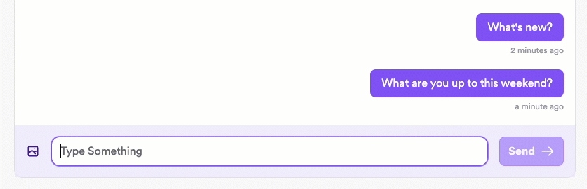

import Tabs from "@theme/Tabs";
import TabItem from "@theme/TabItem";

# Optimistically send messages

When a user sends a message with XMTP, they might experience a slight delay between sending the message and seeing their sent message display in their app UI.

This is because when a user sends a message, they typically have to wait for the XMTP network to finish processing the message before the app can display it in the UI.

Messaging without optimistic sending:



Note the slight delay after clicking **Send**.

Implement optimistic sending to immediately display the sent message in the sender’s UI while processing the message in the background. This provides the user with immediate feedback and enables them to continue messaging without having to wait for their previous message to finish processing.

Messaging with optimistic sending:


The message displays immediately for the sender, with a checkmark indicator displaying once the message has been successfully sent.

## Preserve message order

It’s important to preserve order when sending messages optimistically so that the messages appear on the network in the order that they are sent. If a message is being processed when a user attempts to send another message, the new message should wait for the current message to be processed before being sent.

## Handle send statuses

- After an optimistic message is initially sent, present the user with an indicator that the message is still being processed.
- After an optimistic message is successfully sent, present the user with a success indicator.

## Handle messages that fail to send

In the unexpected event that an optimistic message fails to send, present the user with an option to retry sending the message or to cancel sending. Use a try/catch block to intercept errors and allow the user to retry or cancel.

## Prepare message before sending

Use an XMTP SDK to prepare a message before sending it. This will encrypt and package up the message in the proper format for the XMTP network. After preparing the message, it’s ready to be sent optimistically.

<Tabs groupId="sdk-langs">
<TabItem value="js" label="JavaScript"  attributes={{className: "js_tab"}}>

```tsx
// standard (string) message
const preparedTextMessage = await conversation.prepareMessage(messageText);

// custom content type
const preparedCustomContentMessage = await conversation.prepareMessage(
  customContent,
  {
    contentType,
  },
);
```

</TabItem>
</Tabs>

## Send prepared message

After preparing an optimistic message, use its `send` method to send it.

<Tabs groupId="sdk-langs">
<TabItem value="js" label="JavaScript"  attributes={{className: "js_tab"}}>

```tsx
try {
  preparedMessage.send();
} catch (e) {
  // handle error, enable canceling and retries (see below)
}
```

</TabItem>
</Tabs>
