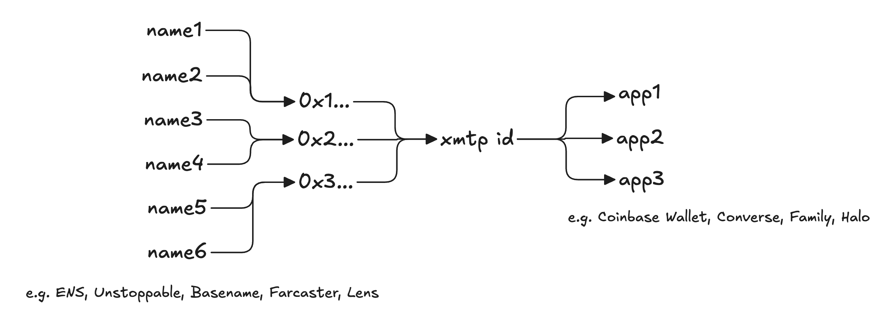

# Identity in XMTP

:::info Key takeaways

- **Why it matters:** XMTP unifies messaging for all your web3 names in one inbox, making it easy to manage communication across apps.
- **How it works:** Wallets and names link to a single identity using secure operations verified by wallet signatures.
- **Future-proof:** Ephemera will seamlessly transition identity to the XMTP appchain in 2025 for enhanced security and censorship resistance.

:::

## All your names, in all your apps

Web3 users maintain different names across their communities - a .base.eth name for Base, Lens and Farcaster handles for social, a .eth name for general use. These names become truly valuable when people can use them to communicate. But apps that support only one name system fragment the messaging potential of web3 names.

XMTP solves this by offering a single messaging identity for all your web3 names and wallets. Whether you're using *alix.eth*, *aa.base.eth*, or *@alixnotalice*, your messages all flow through one inbox, accessible in any XMTP app.



## How it works now

XMTP’s web and mobile SDKs handle three basic identity operations:

```rust
message IdentityAction {
  oneof kind {
    CreateInbox create_inbox = 1;                       // Create a new identity
    AddAssociation add = 2;                             // Associate a new wallet
    RevokeAssociation revoke = 3;                       // Remove a wallet association
    ChangeRecoveryAddress change_recovery_address = 4;  // Change the recovery address
  }
}
```

All associated wallets can access an inbox and associate new wallets. Only a designated recovery wallet can remove associations. By default, this is the wallet that created the identity.

- For each operation, the SDKs verify wallet signatures to ensure authorized changes.
- Only wallet addresses can be directly associated with XMTP identities. Application developers use third-party SDKs to resolve names to these wallet addresses.
- The SDKs keep state current by automatically replaying identity association history.

Currently, Ephemera operates a centralized service to synchronize identity association history across the network.

## Decentralizing identity

In 2025, Ephemera will transition wallet associations to the XMTP appchain, enhancing security and censorship resistance while maintaining state consistency. Ephemera’s centralized service will remain active during this period to ensure seamless functionality for developers and users.

The `IdentityUpdates` contract will govern identity association transactions:

```solidity
event IdentityUpdateCreated(
    bytes32 inboxId,
    bytes update,                // Signed state change from SDK
    uint64 sequenceId
);
```

SDKs will maintain the same simple operations, allowing identity association history to move onchain without affecting developers' implementations. At this point, applications will have two paths for working with messaging identities:

1. **Using XMTP SDKs:** Developers using XMTP for messaging can continue to leverage the SDKs' built-in identity management and third-party libraries for name resolution.
2. **Using the Appchain:** Developers not directly providing messaging, such as infrastructure providers and data platforms, can independently monitor association updates on the XMTP appchain by:
    - Watching chain events and building their own state tracking
    - Using third-party APIs to retrieve the latest state
    - Accessing state permissionlessly via a community-provided subgraph

    Messaging app developers can also verify the SDK using these methods.

### Privacy considerations for onchain identity

Users concerned about linking public and private wallets onchain can create separate XMTP identities for sensitive communications. However, apps catering to these users can merge their identities locally into a single inbox. Future updates may introduce privacy-preserving features for unlinkable identity associations to address these concerns while maintaining a unified inbox.

## Composability

XMTP identity associations enable developers to build new experiences around messaging. Here are the two main patterns:

### Inbox discovery

Find a user's XMTP inbox using any of their wallet addresses or ENS names:

- Notify NFT holders of bids on their tokens via an auction platform.
- Send messages to DAO members for governance proposals.
- Initiate group chats based on shared contract interactions.

### Address discovery

List all wallet addresses and names that can message from a given XMTP inbox:

- Build comprehensive web3 contact cards with ENS, Base, Farcaster, and Lens names
- Display ENS and other blockchain names belonging to a conversation partner
- Verify that different addresses belong to the same XMTP user

## What’s next

- **2025:** Transition wallet associations to the XMTP appchain for enhanced security and censorship resistance.
- **Late 2025:** Expand wallet linking and inbox support to non-EVM ecosystems, such as Solana.
- **2026+:** Introduce privacy-preserving identity features, such as unlinkable associations, to balance privacy with usability.

## FAQ

1. **What differentiates XMTP’s approach to identity? What are its benefits?**

    Unlike traditional systems that bind user identity to a proprietary namespace, XMTP's identity model leverages existing namespaces. Users can consolidate all their names into a single messaging inbox managed by one wallet key, using different names for different contexts.

    *Benefits for users:*

    - Receive all your messages without switching apps.
    - Communicate using any name you own.

    *Benefits for apps and services:*

    - No need to build and maintain your own messaging system.
    - No need to integrate a new namespace.
    - If you have a namespace, XMTP makes it more valuable by extending its reach to more apps.
    - Users can communicate using all their names without switching to other apps.
    - Users can access existing agents and mini-apps developed by the XMTP community.

2. **How secure is this system? What happens if one of my linked wallets gets compromised?**

    XMTP requires a signature for every identity operation. The SDKs automatically verify and replay identity updates, ensuring all changes are authorized. If a wallet linked to an identity is compromised, the recovery wallet can unlink it to protect the inbox. By default, the recovery wallet is the wallet that created the identity.

3. **How do I recover my identity? What if I lose access to my recovery wallet?**

    The first wallet associated with an identity becomes the recovery wallet. This recovery wallet is the only one that can remove other wallet associations. It can also change the recovery address to a different wallet address. If access to the recovery wallet is lost, you can continue using your inbox with other linked wallets, but you won't be able to revoke other wallet associations in case of compromise.

    As a last resort, you can create a new inbox and associate your wallet addresses to it. This ensures continued messaging access, though previous messages tied to the original inbox will remain inaccessible.

4. **Can smart wallets or other smart contracts have XMTP identities?**

    Any EIP-4337 smart wallet can create or link to an XMTP identity and send or receive messages. Other smart contracts can also do this if they support EIP-1271.

5. **How does wallet linking work across chains?**

    Messages sent to any address are delivered to its associated inbox, regardless of the wallet app or blockchain used. Currently, XMTP supports only EVM chains. However, XMTP aims to extend support to wallets on non-EVM ecosystems by late 2025. This expansion will further enhance cross-chain messaging and broaden accessibility.

6. **What is the maximum number of wallets that can be linked to an identity?**

    The XMTP identity system has a maximum limit of 256 wallets that can be linked to a single identity. Revocations and recovery address changes count towards this limit.

7. **Are there any rate limits for identity operations?**

    Yes, Ephemera’s centralized service has rate limits in place to ensure system stability under heavy usage. When the system transitions to the XMTP appchain in 2025, rate limiting will be managed through gas fees for each operation.

8. **What happens during the 2025 appchain transition?**

    The transition to the XMTP appchain will be seamless for users and developers. Existing identities will automatically migrate without disrupting functionality. The SDK interface will remain unchanged, and detailed migration guides will be provided to ensure smooth adoption.

9. **What costs will be associated with identity operations?**

    Currently, wallet linking and unlinking operations are free. However, when the system transitions to the XMTP appchain, these operations will incur small gas fees, likely fractions of a cent. To ease user onboarding, applications can register onchain as fee payers, covering these costs for new users during sign-up.

10. **How public is my identity association history?**

    Identity association history is currently public and viewable through our SDKs. In the future, it will also be recorded onchain, making it permissionlessly accessible. Anyone can construct a list of wallets associated with an identity. Users who wish to maintain a private, unlinkable identity should use a separate identity for any public wallet addresses.
