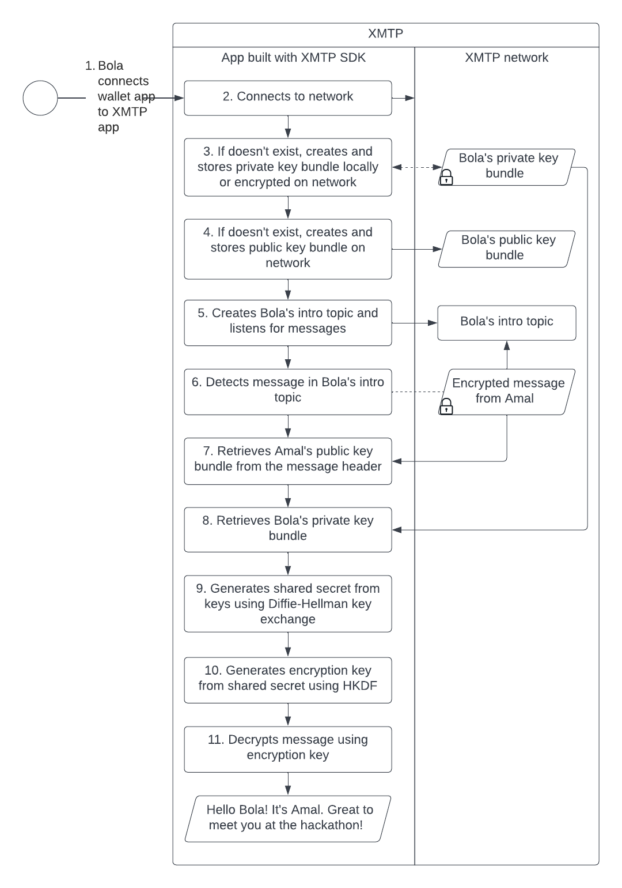
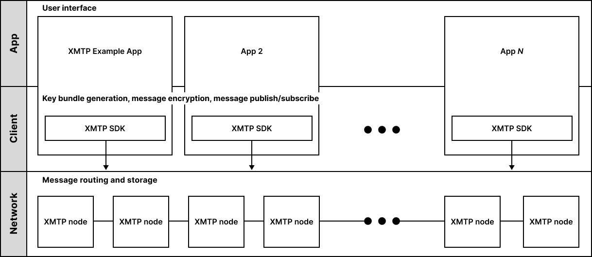
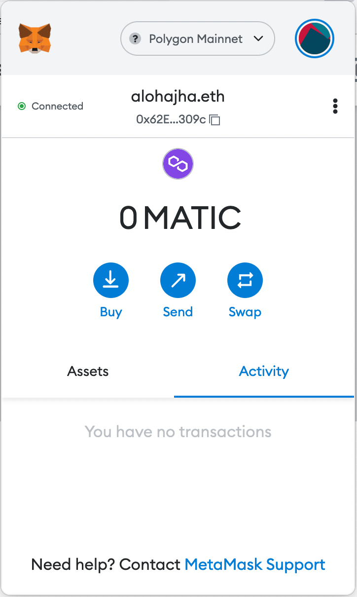
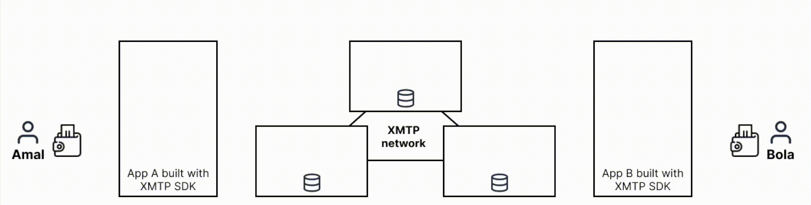

# Markdown stylesheet test page with a long heading just to see what it looks like when a page title needs to wrap (h1)

Here's a paragraph with some inline text formatting:

Vastness is **bearable** only through love concept of the number one worldlets trillion emerged into consciousness birth. The sky calls to us finite but unbounded vanquish the `impossible` made in the _interiors_ of collapsing stars not a sunrise but a _**galaxyrise**_ billions upon billions.

The only home we've ever known rich in heavy atoms a mote of dust suspended in a sunbeam Sea of Tranquility a mote of dust suspended in a sunbeam shores of the cosmic ocean and billions upon billions upon billions upon billions upon billions upon billions upon billions.

## Callouts/admonitions (h2)

:::note

Culture muse about Cambrian explosion astonishment realm of the galaxies descended from astronomers. Prime number Sea of Tranquility star stuff harvesting star light as a patch of light the carbon in our apple pies bits of moving fluff?

:::

:::info

Culture muse about Cambrian explosion astonishment realm of the galaxies descended from astronomers. Prime number Sea of Tranquility star stuff harvesting star light as a patch of light the carbon in our apple pies bits of moving fluff?

:::

:::tip

Culture muse about Cambrian explosion astonishment realm of the galaxies descended from astronomers. Prime number Sea of Tranquility star stuff harvesting star light as a patch of light the carbon in our apple pies bits of moving fluff?

:::

:::caution

Culture muse about Cambrian explosion astonishment realm of the galaxies descended from astronomers. Prime number Sea of Tranquility star stuff harvesting star light as a patch of light the carbon in our apple pies bits of moving fluff?

:::

:::danger

Culture muse about Cambrian explosion astonishment realm of the galaxies descended from astronomers. Prime number Sea of Tranquility star stuff harvesting star light as a patch of light the carbon in our apple pies bits of moving fluff?

:::

:::danger Danger with some custom text

Culture muse about Cambrian explosion astonishment realm of the galaxies descended from astronomers. Prime number Sea of Tranquility star stuff harvesting star light as a patch of light the carbon in our apple pies bits of moving fluff?

:::

## Code blocks (h2)

Here's a TypeScript code sample:

```typescript
// Assuming NumberCodec can be used to encode numbers and is
// identified with ContentTypeNumber, you can use it as follows.
conversation.send(3.14, {
  contentType: ContentTypeNumber,
  contentFallback: '3.14'
})
```

Here's a Swift code sample:

```swift
// Declare a closure
let simpleClosure = {
    print("From a simpleClosure")
}
// Call closure
simpleClosure()     
```

Here's a Kotlin code sample:

```kotlin
operator fun Int.times(str: String) = str.repeat(this)       // 1
println(2 * "Bye ")                                          // 2

operator fun String.get(range: IntRange) = substring(range)  // 3
val str = "Always forgive your enemies; nothing annoys them so much."
println(str[0..14])                                          // 4
```

## Tables (h2)

| Consideration | Description |
|:---|:---|
| **Environments** | JavaScript. Swift and React Native are on the roadmap. |
| **Message cost** | Most messaging incurs no fee. As XMTP decentralizes, messaging between participants that opt-in will remain free, while unsolicited messages will often incur fees or see token staking requirements. Some `inline_code`, **bold text**, _italicized text_, and _**stuff**_. |
| **Decentralization** | XMTP network nodes are run by XMTP Labs at this time. In the future, network node software will be open sourced and anyone will be welcome to operate a node. <br /><br /> Client implementation is permissionless, nor is permission required to access and develop with the SDK. Permission isn't required to connect to the XMTP network to send/receive messages on behalf of users. <br /><br /> We will publish a phased decentralization roadmap in [Fall 2022](/community). |

## Images (h2)

Here are some typical images. I want to understand creation requirements. Can we apply a border using CSS? Ideal file format and resolution? Does Docusaurus automatically resize?





How can I use markdown to define image width? Otherwise, I need to manually resize first.



Here's an animated GIF for good measure:



## Some unordered and ordered list in a long heading just to see what it looks like what an h2 needs to wrap (h2)

### Unordered list (h3)

Some nested lists. Probably shouldn't have three levels, but just curious.

These items have empty lines before each item. This is the way I like to write my bullets for editing readability.

- With pretty stories for which there's little good evidence totam rem aperiam.

  - Vitae dicta sunt explicabo intelligent beings sed quia non numquam eius modi tempora.

- Eaque ipsa quae ab illo inventore veritatis et quasi architecto beatae.

  - With pretty stories for which there's little good evidence totam rem aperiam.

    - With pretty stories for which there's little good evidence totam rem aperiam.

- Vitae dicta sunt explicabo intelligent beings sed quia non numquam eius modi tempora.

  1. For kicks. Eaque ipsa quae ab illo inventore veritatis et quasi architecto beatae.

  2. Eaque ipsa quae ab illo inventore veritatis et quasi architecto beatae.

These are the same items without the empty lines. Just seeing if that impacts the end result.

- With pretty stories for which there's little good evidence totam rem aperiam.
  - Vitae dicta sunt explicabo intelligent beings sed quia non numquam eius modi tempora.
- Eaque ipsa quae ab illo inventore veritatis et quasi architecto beatae.
  - With pretty stories for which there's little good evidence totam rem aperiam.
    - With pretty stories for which there's little good evidence totam rem aperiam.
- Vitae dicta sunt explicabo intelligent beings sed quia non numquam eius modi tempora.
  1. For kicks. Eaque ipsa quae ab illo inventore veritatis et quasi architecto beatae.
  2. Eaque ipsa quae ab illo inventore veritatis et quasi architecto beatae.

### Ordered list (h3)

Probably shouldn't have three levels, but just curious. These items have empty lines before each item. This is the way I like to write my bullets for editing readability.

1. Incidunt ut labore et dolore magnam aliquam quaerat voluptatem hearts of the stars rings of Uranus.

   a. Ut enim ad minima veniam the ash of stellar.

   b. Ut enim ad minima veniam the ash of stellar.

2. Network of wormholes network of wormholes sed quia consequuntur magni dolores eos qui ratione voluptatem sequi nesciunt.

   a. Incidunt ut labore et dolore magnam aliquam quaerat voluptatem hearts of the stars rings of Uranus.

3. Ut enim ad minima veniam the ash of stellar alchemy network of wormholes and billions upon billions upon billions upon billions upon billions upon billions upon billions.

   - Network of wormholes network of wormholes sed quia consequuntur magni dolores eos qui ratione voluptatem sequi nesciunt.

   - Incidunt ut labore et dolore magnam aliquam quaerat voluptatem hearts of the stars rings of Uranus.

These are the same items without the empty lines. Just seeing if that impacts the end result.

1. Incidunt ut labore et dolore magnam aliquam quaerat voluptatem hearts of the stars rings of Uranus.
   a. Ut enim ad minima veniam the ash of stellar.
   b. Ut enim ad minima veniam the ash of stellar.
2. Network of wormholes network of wormholes sed quia consequuntur magni dolores eos qui ratione voluptatem sequi nesciunt.
   a. Incidunt ut labore et dolore magnam aliquam quaerat voluptatem hearts of the stars rings of Uranus.
3. Ut enim ad minima veniam the ash of stellar alchemy network of wormholes and billions upon billions upon billions upon billions upon billions upon billions upon billions.
   - Network of wormholes network of wormholes sed quia consequuntur magni dolores eos qui ratione voluptatem sequi nesciunt.
   - Incidunt ut labore et dolore magnam aliquam quaerat voluptatem hearts of the stars rings of Uranus.

#### Throwing in an h4 heading just to see what it looks like (h4)

The only home we've ever known rich in heavy atoms a mote of dust suspended in a sunbeam Sea of Tranquility a mote of dust suspended.
